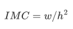
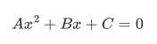
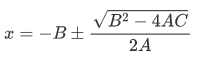

# Pensamiento Computacional Orientado a Objetos.

### TC1033.304

Diseña e implementa utilizando estándares seguros de programación (consulta el documento en recursos de aprendizaje), un programa en lenguaje C++ que resuelva los problemas que se plantean a continuación. 

------

Dentro del folder **ej1** crea el archivo **main.cpp** y en el método **main** resuelve lo siguiente

1.- Se usa una cantidad conocida como índice de masa corporal (IMC) para calcular el riesgo de tener problemas de salud relacionadas con el peso. 

El IMC se calcula con la fórmula siguiente: 

Donde w es el peso en kilogramos y h es la altura en metros. 

Escribe una aplicación que acepte el peso y la altura (ambos enteros) y calcule y muestre el IMC. 

------

Dentro del folder **ej2**  crea el archivo **main.cpp** y en el método **main** resuelve lo siguiente

2.-Escribe una aplicación para resolver ecuaciones cuadráticas de la forma:

Donde los coeficientes A, B, y C son números reales proporcionados por el usuario. Las soluciones para estas ecuaciones se derivan de la fórmula:

Para este ejercicio, puedes asumir que A ≠ 0 y que la relación B al cuadrado es mayor o igual a 4AC por lo que habrá soluciones con números reales para x.

